# Neural Gear: Learning Journey 🧠

A simple yet powerful demonstration of neural network fundamentals using Rust and PyTorch (tch-rs).

## Learning Process Visualization

```mermaid
graph TB
    subgraph Training["1️⃣ Training Data Preparation"]
        direction LR
        I1[1.0] --> I2[2.0] --> I3[3.0] --> I4[4.0]
        R["reshape(-1, 1)"]
    end

    subgraph Network["2️⃣ Neural Network"]
        direction TB
        L1["Linear Layer<br/>(weights + bias)"]
        G["requires_grad_(true)<br/>Enable Learning"]
    end

    subgraph Learning["3️⃣ Learning Process"]
        direction TB
        P["Predictions"]
        T["Targets (2x + 1)"]
        Loss["MSE Loss"]
        Back["Backward Pass<br/>Update Weights"]
    end

    subgraph Save["4️⃣ Model Save/Load"]
        direction TB
        S1["Save Model<br/>model.ot"]
        S2["Load Model<br/>For Predictions"]
    end

    %% Connections with code alignment
    Training --> |"create_training_data()"| R
    R --> |"tensor.reshape()"| Network
    Network --> |"model.forward()"| P
    T --> |"mse_loss()"| Loss
    P --> |"mse_loss()"| Loss
    Loss --> |"opt.backward_step()"| Back
    Back --> |"500 epochs"| Network
    Network --> |"save_model()"| Save

    %% Styling
    classDef input fill:#e1bee7,stroke:#6a1b9a,stroke-width:2px,color:#000
    classDef network fill:#bbdefb,stroke:#1565c0,stroke-width:2px,color:#000
    classDef learning fill:#c8e6c9,stroke:#2e7d32,stroke-width:2px,color:#000
    classDef save fill:#ffecb3,stroke:#ff8f00,stroke-width:2px,color:#000
    classDef data fill:#fff3e0,stroke:#e65100,stroke-width:2px,color:#000

    class I1,I2,I3,I4,R input
    class L1,G network
    class P,T,Loss,Back learning
    class S1,S2 save
```



## What's Happening?

1. **Training Data** (🎲): Numbers we want our AI to learn from
   - Input: `[1.0, 2.0, 3.0, 4.0]`
   - Each number gets stacked into a tower shape

2. **Neural Network** (🧠): A simple linear model that learns the pattern
   - Tries to learn the recipe: `output = input × 2 + 1`
   - Has weights and biases that it adjusts during training

3. **Learning Process** (📚):
   - Makes predictions
   - Compares with correct answers
   - Updates its understanding
   - Repeats 500 times to get better!

## Code Structure

Our code follows the same four steps shown in the diagram:

1. **Data Preparation** (`create_training_data`, `create_target_data`)
   - Creates input tensor `[1.0, 2.0, 3.0, 4.0]`
   - Reshapes into proper dimensions
   - Enables gradient tracking

2. **Neural Network** (`build_model`)
   - Defines linear layer
   - Sets up weights and biases
   - Prepares for learning

3. **Learning Process** (`train_model`)
   - Makes predictions
   - Calculates loss
   - Updates weights
   - Repeats for 500 epochs

4. **Model Persistence** (`save_model`, `predict`)
   - Saves trained model
   - Loads for predictions

## Running the Project

```bash
cargo run
```

Watch as the AI learns! The "loss" number gets smaller as it gets better at predictions.

## Dependencies
- Rust
- tch (PyTorch for Rust)
