# Neural Gear: Learning Journey 🧠

A simple yet powerful demonstration of neural network fundamentals using Rust and PyTorch (tch-rs).

## Learning Process Visualization

```mermaid
graph TB
    subgraph Input[Training Data]
        A1[1.0]
        A2[2.0]
        A3[3.0]
        A4[4.0]
    end

    subgraph Network[Neural Network]
        direction TB
        M1[Linear Layer]
        M2[Weight × Input + Bias]
    end

    subgraph Output[Results]
        P[Prediction]
        T[Target: input × 2 + 1]
        L[Loss Function]
    end

    Input --> |Reshape to Tower| Network
    Network --> |Forward Pass| P
    T --> |Compare| L
    P --> |Compare| L
    L --> |Backward Pass| Network
    Network --> |Update Weights| Network

    classDef input fill:#f9f,stroke:#333,stroke-width:2px
    classDef network fill:#bbf,stroke:#333,stroke-width:2px,color:#000
    classDef output fill:#dfd,stroke:#333,stroke-width:2px
    classDef target fill:#f96,stroke:#333,stroke-width:2px
    classDef loss fill:#ff9,stroke:#333,stroke-width:2px

    class A1,A2,A3,A4 input
    class M1,M2 network
    class P output
    class T target
    class L loss
```



## What's Happening?

1. **Training Data** (🎲): Numbers we want our AI to learn from
   - Input: `[1.0, 2.0, 3.0, 4.0]`
   - Each number gets stacked into a tower shape

2. **Neural Network** (🧠): A simple linear model that learns the pattern
   - Tries to learn the recipe: `output = input × 2 + 1`
   - Has weights and biases that it adjusts during training

3. **Learning Process** (📚):
   - Makes predictions
   - Compares with correct answers
   - Updates its understanding
   - Repeats 500 times to get better!

## Running the Project

```bash
cargo run
```

Watch as the AI learns! The "loss" number gets smaller as it gets better at predictions.

## Dependencies
- Rust
- tch (PyTorch for Rust)
