# Neural Gear: Learning Journey 🧠

A simple yet powerful demonstration of neural network fundamentals using Rust and PyTorch (tch-rs).

## Learning Process Visualization

```mermaid
graph TB
    %% Define spaces for better layout
    subgraph Training["1️⃣ Training Data Preparation 📊"]
        direction TB
        Data["Raw Data"]
        I1[1.0] & I2[2.0] & I3[3.0] & I4[4.0]
        R["reshape(-1, 1)<br/>Stack into Tower"]
        Tower["┌─────┐<br/>│ 1.0 │<br/>│ 2.0 │<br/>│ 3.0 │<br/>│ 4.0 │<br/>└─────┘"]
        
        Data --> I1 & I2 & I3 & I4
        I1 & I2 & I3 & I4 --> R
        R --> Tower
    end

    subgraph Network["2️⃣ Neural Network 🤖"]
        direction TB
        L1["Linear Layer<br/>(weights + bias)"]
        G["requires_grad_(true)<br/>Track Learning Path"]
    end

    subgraph Learning["3️⃣ Learning Process 🎯"]
        direction TB
        P["Predictions<br/>y = wx + b"]
        T["Targets<br/>y = 2x + 1"]
        Loss["MSE Loss<br/>How far off?"]
        Back["Backward Pass<br/>learning_rate: 0.1"]
    end

    subgraph Save["4️⃣ Model Save/Load 💾"]
        direction TB
        S1["Save Model<br/>model.ot"]
        S2["Load Model<br/>For New Predictions"]
    end

    %% Connections with code alignment
    Data --> |"create_training_data()"| R
    Tower --> |"tensor.reshape()"| Network
    Network --> |"model.forward()"| P
    T --> |"mse_loss()"| Loss
    P --> |"mse_loss()"| Loss
    Loss --> |"opt.backward_step()"| Back
    Back --> |"500 epochs"| Network
    Network --> |"save_model()"| Save

    %% Styling with softer colors
    classDef input fill:#e1bee7,stroke:#6a1b9a,stroke-width:2px,color:#000,rx:10px
    classDef network fill:#bbdefb,stroke:#1565c0,stroke-width:2px,color:#000,rx:10px
    classDef learning fill:#c8e6c9,stroke:#2e7d32,stroke-width:2px,color:#000,rx:10px
    classDef save fill:#ffecb3,stroke:#ff8f00,stroke-width:2px,color:#000,rx:10px
    classDef data fill:#fff3e0,stroke:#e65100,stroke-width:2px,color:#000,rx:10px
    classDef tower fill:#e1bee7,stroke:#6a1b9a,stroke-width:2px,color:#000,rx:0px,font-family:monospace

    class Data,I1,I2,I3,I4,R input
    class L1,G network
    class P,T,Loss,Back learning
    class S1,S2 save
    class Tower tower
```



## Code Structure

Our code follows these four steps, creating a simple yet effective learning system:

1. **Data Preparation** 📊 (`create_training_data`, `create_target_data`)
   - Creates input tensor `[1.0, 2.0, 3.0, 4.0]`
   - Reshapes into a tower (matrix)
   - Enables gradient tracking for learning

2. **Neural Network** 🤖 (`build_model`)
   - Sets up a linear layer
   - Initializes weights and biases
   - Prepares the learning pathway

3. **Learning Process** 🎯 (`train_model`)
   - Makes predictions using `y = wx + b`
   - Calculates how far off we are (MSE loss)
   - Updates weights with learning rate 0.1
   - Repeats 500 times to perfect the recipe

4. **Model Persistence** 💾 (`save_model`, `predict`)
   - Saves the trained brain to `model.ot`
   - Loads it back for new predictions

## Running the Project

```bash
cargo run
```

Watch the magic happen! You'll see the loss number get smaller as our AI gets better at learning the pattern `y = 2x + 1`. 🎓

## Dependencies
- Rust 🦀
- tch (PyTorch for Rust) 🔥
